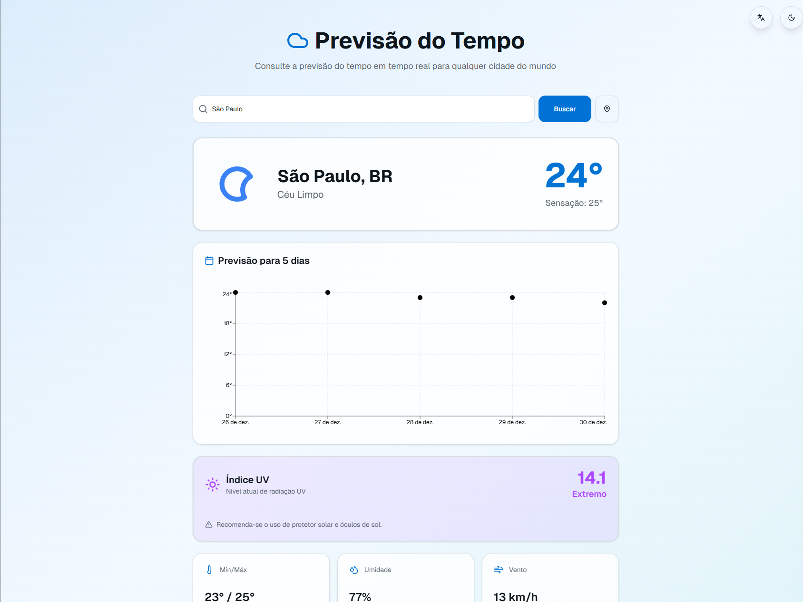
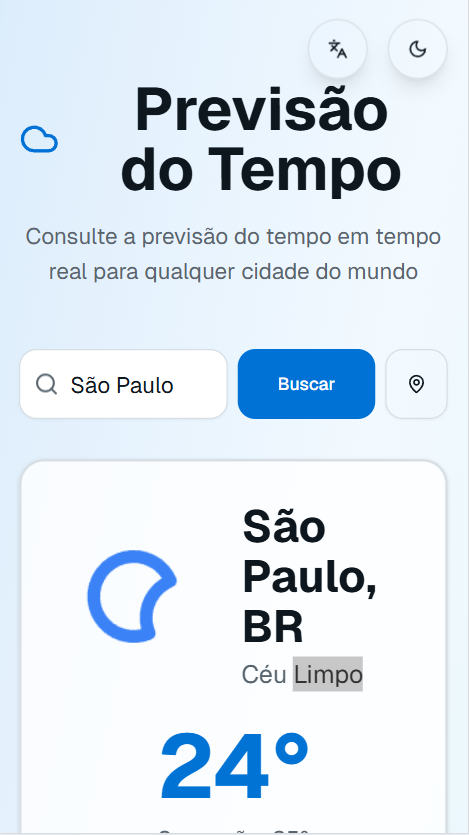

# Weather Forecast – Next.js Application

[](https://nextjs.org/docs)
[](https://react.dev/)
[](https://www.typescriptlang.org/docs/)
[](https://tailwindcss.com/docs)
[](LICENSE)

Um aplicativo moderno e completo de previsão do tempo construído com Next.js 16, React 19 e TypeScript. O app oferece dados meteorológicos em tempo real, previsão de 5 dias com gráficos interativos, suporte multilíngue, tema dark/light, índice UV, geolocalização automática e autocompletar de cidades.

### Screenshots

#### Desktop


#### Mobile


### Acesse o App
[Ver Previsão do Tempo Online](https://weather-forecast-app-rho-nine.vercel.app/)

## Features Implementadas

### Core Features
- **Previsão Atual**: Temperatura, sensação térmica, umidade, velocidade do vento, pressão atmosférica e nebulosidade
- **Previsão de 5 Dias**: Visualização com gráfico interativo de temperaturas usando Recharts
- **Índice UV**: Display em tempo real com alertas visuais baseados no nível de radiação (Baixo, Moderado, Alto, Muito Alto, Extremo)
- **Ícones Climáticos**: Integração com ícones oficiais da API OpenWeatherMap mostrando condições reais (sol, chuva, nuvens, etc.)
- **Ícones Climáticos**: Integração com ícones oficiais da API OpenWeatherMap mostrando condições reais (sol, chuva, nuvens, etc.)

### UX/UI Avançada
- **Tema Dark/Light Mode**: Toggle persistente com suporte completo em todos os componentes, incluindo gráficos
- **Suporte Multilíngue (i18n)**: Interface totalmente traduzida em Português (BR), Inglês (US) e Espanhol (ES)
- **Autocompletar Inteligente**: Busca de cidades com sugestões em tempo real priorizadas por idioma/região
- **Geolocalização**: Detecção automática da localização do usuário com um clique
- **Histórico de Buscas**: Salvamento local das últimas cidades pesquisadas
- **Design Responsivo**: Interface adaptável para desktop, tablet e mobile
- **Animações Suaves**: Transições e efeitos visuais modernos com fade-in e slide-up
- **Skeleton Loaders**: Estados de carregamento elegantes

### Progressive Web App (PWA)
- **Manifest Configurado**: Ícones, cores temáticas e configuração completa para instalação
- **Pronto para Offline**: Estrutura preparada para service workers

## Tecnologias

- **Framework**: Next.js 16 (App Router)
- **UI Library**: React 19.2
- **Linguagem**: TypeScript
- **Estilização**: Tailwind CSS v4
- **Componentes**: shadcn/ui
- **Gráficos**: Recharts
- **Ícones**: Lucide React
- **API**: OpenWeatherMap API (Weather Data, Forecast, UV Index, Geocoding)

## Pré-requisitos

- Node.js 18+ instalado
- Chave de API do OpenWeatherMap (gratuita)

## Instalação

1. Clone o repositório:
```bash
git clone <seu-repositorio>
cd weather-forecast-app
```

2. Instale as dependências:
```bash
npm install
```

3. Configure as variáveis de ambiente:

Se estiver rodando localmente, crie um arquivo `.env.local` na raiz do projeto:
```env
OPENWEATHER_API_KEY=sua_chave_aqui
```

Se estiver usando v0, adicione a variável na seção **Vars** (variáveis) do painel lateral.

Para obter uma chave gratuita, acesse: [OpenWeatherMap API](https://openweathermap.org/api)

4. Execute o projeto em desenvolvimento:
```bash
npm run dev
```

5. Abra [http://localhost:3000](http://localhost:3000) no navegador

## Estrutura do Projeto

```
weather-forecast-app/
├── app/
│   ├── api/
│   │   ├── weather/route.ts      # Endpoint para dados meteorológicos atuais
│   │   ├── forecast/route.ts     # Endpoint para previsão de 5 dias
│   │   ├── uv/route.ts           # Endpoint para índice UV
│   │   └── cities/route.ts       # Endpoint seguro para autocompletar cidades
│   ├── layout.tsx                # Layout principal com metadata e viewport
│   ├── page.tsx                  # Página inicial com Context Providers
│   ├── loading.tsx               # Loading state para Suspense
│   └── globals.css               # Estilos globais e design tokens (light/dark)
├── components/
│   ├── weather-search.tsx        # Busca com autocompletar e geolocalização
│   ├── weather-display.tsx       # Display de dados meteorológicos com ícones
│   ├── forecast-chart.tsx        # Gráfico de previsão com suporte a dark mode
│   ├── uv-index-display.tsx      # Display de índice UV com alertas
│   ├── theme-toggle.tsx          # Toggle de tema dark/light
│   └── language-toggle.tsx       # Seletor de idiomas
├── lib/
│   └── translations.ts           # Sistema de traduções (pt-BR, en-US, es-ES)
├── public/
│   └── manifest.json             # PWA manifest
├── types/                        # Declarações de tipos personalizados
│   └── react-animated-weather.d.ts
├── LICENSE                       # Licença MIT
└── README.md                     # Este arquivo
```

## API Routes

### GET `/api/weather?city={cityName}`
Retorna dados meteorológicos atuais para a cidade especificada.

**Resposta:**
```json
{
  "name": "São Paulo",
  "sys": { "country": "BR" },
  "main": {
    "temp": 25.5,
    "feels_like": 26.2,
    "humidity": 65,
    "pressure": 1013
  },
  "weather": [
    {
      "main": "Clear",
      "description": "céu limpo",
      "icon": "01d"
    }
  ],
  "wind": { "speed": 3.5 },
  "clouds": { "all": 10 },
  "rain": { "1h": 0 }
}
```

### GET `/api/forecast?city={cityName}`
Retorna previsão de 5 dias para a cidade especificada (dados a cada 3 horas).

### GET `/api/uv?lat={latitude}&lon={longitude}`
Retorna o índice UV atual para as coordenadas especificadas.

### GET `/api/cities?query={searchTerm}&lang={language}`
Retorna sugestões de cidades para autocompletar (máximo 5 resultados).

## Internacionalização

O app suporta 3 idiomas com traduções completas:

- **Português (pt-BR)**: Idioma padrão, prioriza cidades brasileiras no autocompletar
- **Inglês (en-US)**: Prioriza cidades dos EUA e países anglófonos
- **Espanhol (es-ES)**: Prioriza cidades da América Latina e Espanha

Todas as strings da interface são traduzidas, incluindo:
- Título e subtítulo
- Labels de campos (temperatura, umidade, vento, etc.)
- Botões e mensagens
- Alertas de índice UV
- Estados de erro e carregamento

## Tema Dark/Light Mode

O tema é persistido no localStorage e aplicado em:
- Backgrounds e cards
- Textos e títulos
- Gráficos (linhas e labels do Recharts)
- Ícones e botões
- Gradientes e sombras

## Features Técnicas para Recrutadores

### Arquitetura e Padrões
- **Server Components**: Uso otimizado de React Server Components
- **Client Components**: Separação clara com diretiva 'use client'
- **API Routes**: Backend serverless com Next.js Route Handlers
- **Type Safety**: TypeScript com tipagem completa em todos os arquivos
- **Clean Code**: Componentização, separação de concerns e DRY principles

### Performance e Otimização
- **Cache de API**: Revalidação inteligente de dados
- **Lazy Loading**: Carregamento otimizado de componentes
- **Debounce**: Autocompletar otimizado para reduzir chamadas à API
- **Skeleton Loaders**: Melhor perceived performance

### UX e Acessibilidade
- **Responsive Design**: Mobile-first com Tailwind CSS
- **Loading States**: Feedback visual em todas as operações assíncronas
- **Error Handling**: Tratamento robusto de erros com mensagens amigáveis
- **Keyboard Navigation**: Suporte completo para navegação por teclado
- **ARIA Attributes**: Acessibilidade para leitores de tela

### Segurança
- **API Key Protection**: Chaves de API protegidas no servidor (não expostas no cliente)
- **Environment Variables**: Configuração segura de variáveis sensíveis
- **Input Validation**: Validação de entradas do usuário

### Estado e Persistência
- **Context API**: Gerenciamento de estado global (tema e idioma)
- **LocalStorage**: Persistência de preferências e histórico
- **React Hooks**: useState, useEffect, useCallback, useMemo otimizados


## Melhorias Futuras Possíveis

- [ ] Notificações push de alertas meteorológicos severos
- [ ] Comparação lado a lado de múltiplas cidades
- [ ] Gráficos adicionais (precipitação por hora, direção do vento)
- [ ] Integração com mapas (radar de chuva)
- [ ] Service Workers para cache offline completo
- [ ] Testes unitários (Jest) e E2E (Playwright)
- [ ] Animações meteorológicas de fundo (chuva, neve, etc.)


## Autor

**Rodrigo Costa**

- 💼 LinkedIn: https://www.linkedin.com/in/rodrigopc-developer/ 
- 💻 GitHub: https://github.com/Rodrigopcosta
- 🌐 Portfólio: https://rodrigopcosta.github.io/

Projeto desenvolvido para demonstrar competências em desenvolvimento Frontend moderno, com foco em performance, UX e boas práticas.
- **React 19 e Next.js 16** (features mais recentes)
- **TypeScript** avançado com tipagem completa
- **API Integration** com múltiplos endpoints
- **Internacionalização (i18n)** e acessibilidade
- **Design System** com Tailwind CSS v4
- **UX/UI best practices** e design responsivo
- **Performance optimization** e caching strategies
- **Security** (proteção de API keys, validação de inputs)

---

**Nota Importante**: 
- Este projeto utiliza a API gratuita do OpenWeatherMap que possui limite de 60 chamadas por minuto
- Para uso em produção com alto tráfego, considere planos pagos da OpenWeatherMap
- A chave de API deve ser mantida em segredo e nunca commitada no repositório
